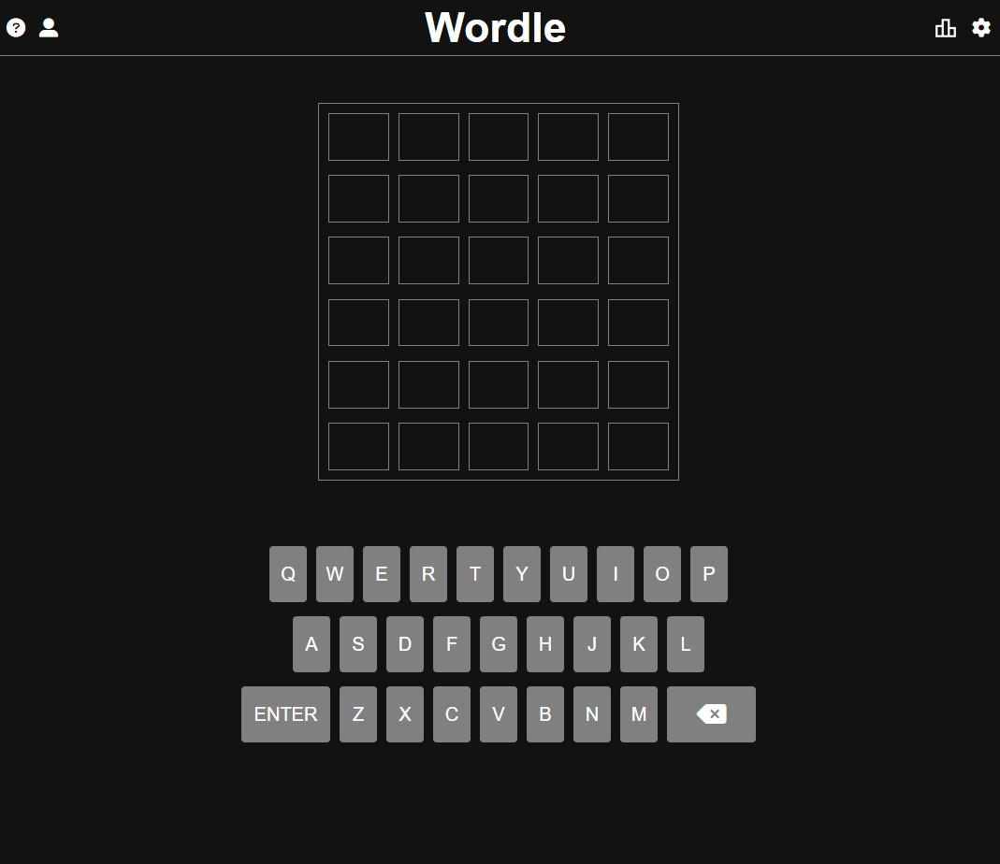

# Wordle Clone

### Application deployed on Render.com

### Link - [Wordle Clone](https://wordle-f32h.onrender.com/)

Note
Since application is deployed on Render using free plan here is what you need to know: "A free plan will spin down after 15 minutes of inactivity, and the next request will spin it back up, which can take around 30 seconds".

---

### Rules

Guess the <strong>WORDLE</strong> in six tries.

Each guess must be a valid five-letter word. Hit the enter button to
submit.

After each guess, the color of the tiles will change to show how close
your guess was to the word.

If the letter is in the word and at the correct position it will be marked as green.
If the letter is in the word but at the wrong position it will be marked as yellow.
If the letter is not in the word it will be marked as gray/black.

---

## Licenca

MIT Licenca

Autorsko pravo(c) Kenan Dropić.
